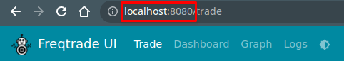
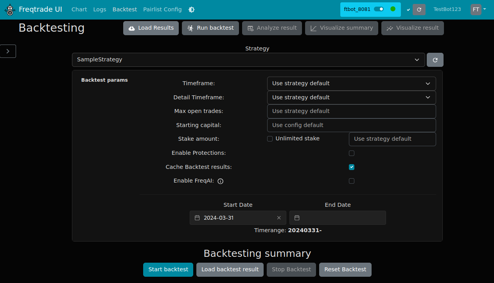

# Local Gate.io Setup

This page documents the local dry-run setup that is included with this repository.

It uses:

- `gateio` spot markets
- `BTC/USDT` and `ETH/USDT`
- `5m` timeframe
- `SampleStrategy`
- port `8080` for the trading UI
- port `8081` for the standalone download/backtest UI

## Screenshots

Trading and backtesting pages use the standard freqUI screens already included in this repository.

Trading and UI access example:



Backtesting page example:



## Config files

Copy the provided example files into `user_data/`:

```bash
cp config_examples/config_gateio_local.example.json user_data/config.json
cp config_examples/config_gateio_webserver.example.json user_data/config.webserver.json
```

Then replace the placeholder values in:

- `api_server.jwt_secret_key`
- `api_server.ws_token`
- `api_server.password`
- `exchange.key`
- `exchange.secret`

## Start the trading UI

Run:

```bash
freqtrade trade --config user_data/config.json --strategy SampleStrategy
```

Open:

```text
http://127.0.0.1:8080
```

## Start the download and backtest UI

Run this in a second terminal:

```bash
freqtrade webserver -c user_data/config.json -c user_data/config.webserver.json
```

Open:

```text
http://127.0.0.1:8081
```

## Download example data

```bash
freqtrade download-data --config user_data/config.json --pairs BTC/USDT ETH/USDT -t 5m --days 7
```

## Run the example backtest

```bash
freqtrade backtesting --config user_data/config.json --strategy SampleStrategy --timeframe 5m --timerange 20260407-20260414
```

Expected result from the setup run in this repository:

- Starting balance: `1000 USDT`
- Final balance: `1002.398 USDT`
- Total profit: `2.398 USDT`
- Total trades: `8`

## UI backtest parameters

Use these values in the backtest page:

- Strategy: `SampleStrategy`
- Timeframe: `5m`
- Detail Timeframe: `Use strategy default`
- Starting capital: `1000`
- Stake amount: `30`
- Enable Protections: `off`
- Enable FreqAI: `off`
- Start Date: `2026-04-07`
- End Date: `2026-04-14`

## Notes

- Use port `8081` for download and backtest pages.
- Use port `8080` for the running trade bot.
- `user_data/config.json` is intentionally ignored by git so live secrets are not committed.
- If the backtest page appears stuck at `startup 0.00%`, refresh the page and use `Load backtest result` to open the generated result file.

## Related release note

See [release-notes-gateio-local-setup.md](release-notes-gateio-local-setup.md) for a short summary of what was prepared in this setup snapshot.